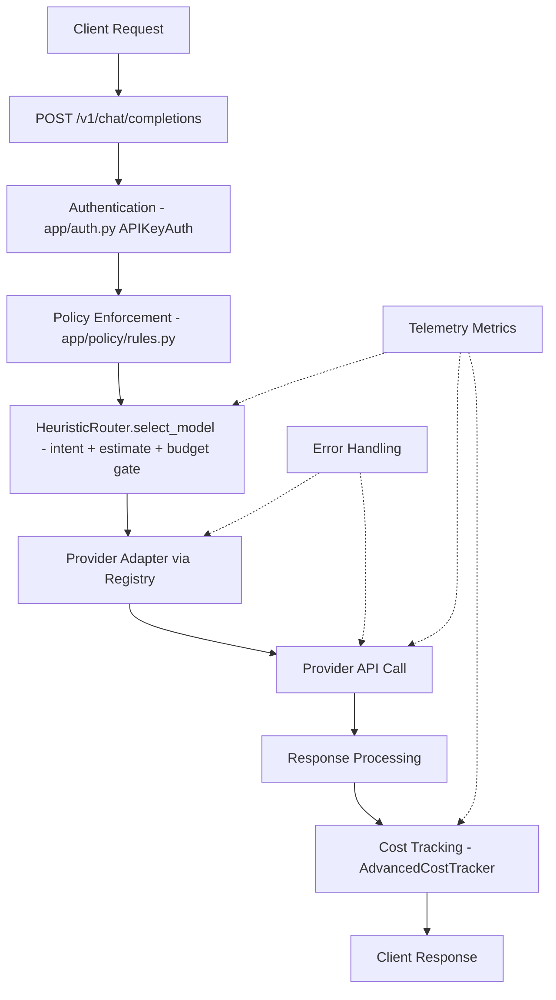
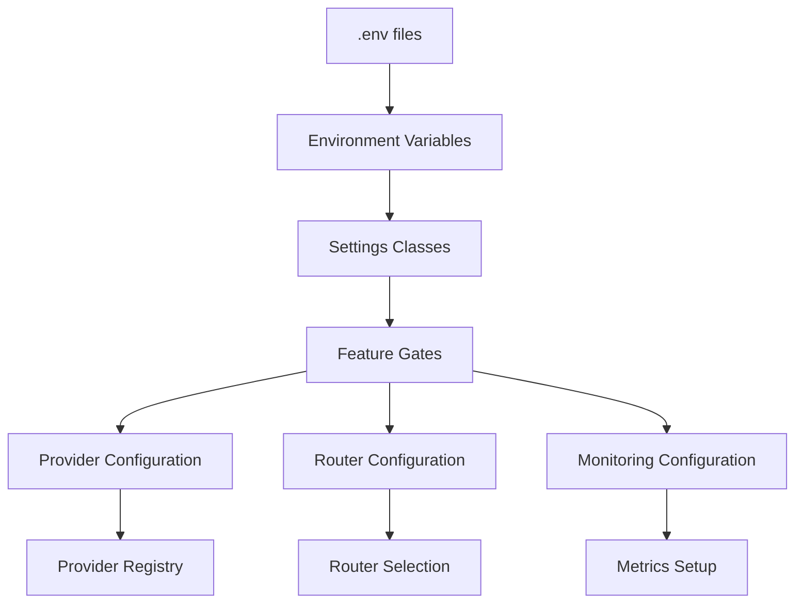

# ModelMuxer Architecture Overview

## System Overview

ModelMuxer is an enterprise-grade intelligent LLM routing engine designed for cost and performance optimization. The system intelligently routes requests to the most appropriate LLM provider based on content analysis, cost constraints, and performance requirements.

## Core Architecture Patterns

### 1. **Layered Architecture**
```
┌─────────────────┐
│   API Layer     │  ← FastAPI endpoints, middleware
├─────────────────┤
│  Service Layer  │  ← Business logic, routing, providers
├─────────────────┤
│   Core Layer    │  ← Interfaces, abstractions, utilities
├─────────────────┤
│ Persistence     │  ← Database, caching, configuration
└─────────────────┘
```

### 2. **Single Router (Heuristic)**
The system uses one router, `HeuristicRouter` in `app/router.py`:
- **Intent Classification**: Lightweight intent classification (`app/core/intent.py`)
- **Cost Estimation & Budget Gate**: Pre-request estimation and enforcement (`app/core/costing.py`)
- **Latency Priors**: In-memory latency percentile tracking used for ETA estimates

### 3. **Adapter Pattern (Providers)**
Unified interface for multiple LLM providers through adapter classes:
- **Interface**: `LLMProviderAdapter` in `app/providers/base.py` (unified `invoke()` method)
- **Provider Registry**: Centralized provider management via `get_provider_registry()` in `app/providers/registry.py`

### 4. **Configuration-Driven Architecture**
Two deployment modes via `features.mode`:
- **Basic Mode** (default): Standard behavior with lenient startup validation
- **Production Mode**: Strict validation with hard startup failures on misconfiguration

## Component Relationships

### Core Components

#### 1. **API Layer (`app/main.py`, `app/api/routes/`)**
- **FastAPI Application**: `app/main.py` contains the app factory, lifespan (DB, provider registry, router init), CORS/security-headers/request-size/observability middleware, exception handlers, and the `get_authenticated_user` dependency
- **Route Modules**:
  - `app/api/routes/chat.py`: `POST /v1/chat/completions`, streaming helper, `POST /v1/messages` + `/messages` (Anthropic compatibility)
  - `app/api/routes/system.py`: `GET /health`, `GET /metrics`, `GET /metrics/prometheus`
  - `app/api/routes/analytics.py`: `GET /v1/analytics/costs`, `GET/POST /v1/analytics/budgets`, `GET /user/stats`
  - `app/api/routes/providers.py`: `GET /providers`, `GET /v1/providers`, `GET /v1/models`

#### 2. **Routing System (`app/router.py`)**
```
HeuristicRouter
    ├── Intent classification (app/core/intent.py)
    ├── Cost estimation + budget gate (app/core/costing.py)
    └── Latency priors (in-memory percentile tracking)
```

**Key Features:**
- **Content Analysis**: Pattern matching, complexity analysis, keyword detection
- **Budget Gate**: Pre-request cost estimation with automatic down-routing to cheaper models
- **Fallback Logic**: Circuit breaker patterns, graceful degradation
- **Monitoring Integration**: Metrics collection, decision logging

#### 3. **Provider System (`app/providers/`)**
```
LLMProviderAdapter (app/providers/base.py)
    ├── OpenAIAdapter
    ├── AnthropicAdapter
    ├── GoogleAdapter
    ├── GroqAdapter
    ├── TogetherAdapter
    ├── CohereAdapter
    └── MistralAdapter
```

Adapters are registered in `app/providers/registry.py` and accessed via `get_provider_registry()`.

**Key Features:**
- **Unified Interface**: Consistent API across all providers
- **Error Handling**: Retry logic, timeout management, circuit breakers
- **Cost Calculation**: Real-time cost estimation and tracking
- **Rate Limiting**: Provider-specific rate limit handling

#### 4. **Configuration System (`app/settings.py`)**
```
Settings (pydantic-settings, exposes `settings`)
    ├── API Settings
    ├── Database Settings
    ├── Redis Settings
    ├── Security Settings
    ├── Routing Settings
    ├── Provider Settings
    └── Monitoring Settings
```

**Key Features:**
- **Environment-Based**: Different configs for dev/staging/production
- **Validation**: Type-safe configuration with Pydantic
- **Feature Gating**: Mode-based strictness (`features.mode` = "basic" or "production")

#### 5. **Monitoring & Observability (`app/telemetry/`)**
```
Telemetry
    ├── Prometheus Metrics (app/telemetry/metrics.py)
    ├── OpenTelemetry Tracing (app/telemetry/tracing.py)
    ├── Structured Logging (app/telemetry/logging.py)
    └── Health Checks (/health endpoint)
```

**Key Features:**
- **Request Metrics**: Response time, success rate, error rates
- **Cost Metrics**: Total cost, cost per request, budget utilization
- **Routing Metrics**: Selection accuracy, fallback frequency
- **Provider Metrics**: Availability, rate limits, response quality

## Data Flow Architecture

### Request Processing Flow



### Configuration Flow



## Key Interfaces and Abstractions

### 1. **HeuristicRouter (`app/router.py`)**
```python
class HeuristicRouter:
    async def select_model(
        self,
        messages: list[ChatMessage],
        user_id: str | None = None,
        budget_constraint: float | None = None,
        max_tokens: int | None = None,
    ) -> tuple[str, str, str, dict[str, object], dict[str, object]]:
        """Select the best model based on prompt analysis and constraints."""
```

### 2. **LLMProviderAdapter (`app/providers/base.py`)**
```python
class LLMProviderAdapter(ABC):
    async def invoke(self, model: str, prompt: str, **kwargs: Any) -> ProviderResponse:
        """Invoke the provider and return a standardized response."""

    async def aclose(self) -> None:
        """Close the adapter's HTTP client and clean up resources."""

    def get_supported_models(self) -> list[str]:
        """Get the list of models supported by this provider."""
```

## Dependency Organization

### Core Dependencies
- **FastAPI**: Web framework for API endpoints
- **Pydantic**: Data validation and settings management
- **SQLAlchemy**: Database ORM and connection management
- **Redis**: Caching and session management
- **Structlog**: Structured logging

### Provider Dependencies
- **httpx**: Async HTTP client for provider APIs
- **tiktoken**: Token counting for OpenAI models
- **tenacity**: Retry logic for resilient API calls

### Optional Dependencies
- **Monitoring Group**: `prometheus-client`, `opentelemetry-*`
- **Development Group**: Testing, linting, and quality tools

### Security Dependencies
- **cryptography**: Secure credential handling
- **passlib**: Password hashing
- **pyjwt**: JWT token management

## Configuration Modes

### Basic Mode (default)
- Heuristic routing with intent classification and budget gating
- Lenient startup validation (warnings instead of hard failures)
- SQLite database by default
- Redis optional (cost tracker falls back to an in-memory mock)

### Production Mode
- Same features as basic mode
- Strict startup validation: hard failure if no providers are configured or the router configuration is invalid

## Security Architecture

### Authentication & Authorization
- API key authentication (`APIKeyAuth` in `app/auth.py`)
- Request validation and sanitization

### Data Protection
- PII redaction via policy enforcement (`app/policy/rules.py`)
- Secure credential management
- Secure httpx client for provider calls (`app/security/config.py`)
- Input validation and sanitization

### Infrastructure Security
- Rate limiting
- DDoS protection
- Security headers
- Container security

## Monitoring & Observability

### Metrics Collection
- **Request Metrics**: Response times, success rates, error rates
- **Cost Metrics**: Total costs, per-request costs, budget utilization
- **Routing Metrics**: Selection accuracy, fallback frequency
- **Provider Metrics**: Availability, rate limits, performance

### Logging Strategy
- **Structured Logging**: JSON format with consistent fields
- **Log Levels**: DEBUG (routing), INFO (requests), WARN (fallbacks), ERROR (failures)
- **Correlation IDs**: Request tracing across components
- **Security**: No sensitive data in production logs

### Health Checks
- **Basic Health**: Core functionality verification
- **Detailed Health**: Provider connectivity checks
- **Metrics Endpoint**: Prometheus-compatible metrics

## Deployment Architecture

### Containerization
- Multi-stage Docker builds
- Minimal base images
- Resource limits and health checks
- Security hardening

### Infrastructure
- Kubernetes deployment manifests
- Horizontal Pod Autoscaling
- Service mesh integration
- Database and cache clustering

### CI/CD Pipeline
- Automated testing and quality gates
- Security scanning
- Dependency vulnerability checks
- Performance regression testing

## Performance Characteristics

### Routing Performance
- **Decision Time**: <100ms for production routing decisions
- **Concurrency**: Async/await patterns throughout
- **Resource Usage**: Minimal memory footprint

### Scalability
- **Horizontal Scaling**: Stateless design enables easy scaling
- **Provider Scaling**: Dynamic provider registration
- **Database**: Connection pooling and query optimization

## Testing Strategy

### Test Organization
- **Unit Tests**: Provider and router logic testing
- **Integration Tests**: End-to-end request flows
- **Performance Tests**: Load testing and benchmarking
- **Security Tests**: Vulnerability scanning and penetration testing

### Test Coverage
- **Target**: 80%+ code coverage
- **Mocking**: Comprehensive mocking for external dependencies
- **Fixtures**: Realistic test data and scenarios
- **CI/CD**: Automated testing pipeline

## Development Workflow

### Code Quality
- **Linting**: Ruff for code style and error detection
- **Formatting**: Black for consistent code formatting
- **Type Checking**: MyPy for static type analysis
- **Security**: Bandit for security vulnerability detection

### Version Control
- **Branching**: Feature branches with conventional commits
- **Reviews**: Code review requirements for all changes
- **CI/CD**: Automated quality gates and testing
- **Documentation**: Updated with all changes

This architecture provides a robust, scalable, and maintainable foundation for intelligent LLM routing with enterprise-grade features and comprehensive monitoring capabilities.