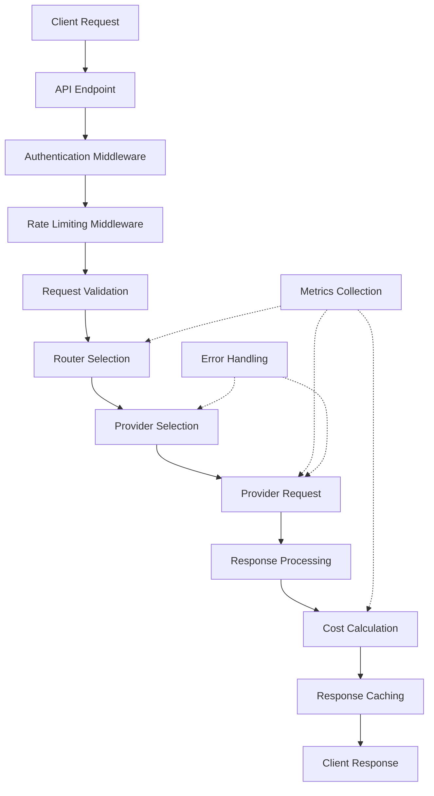
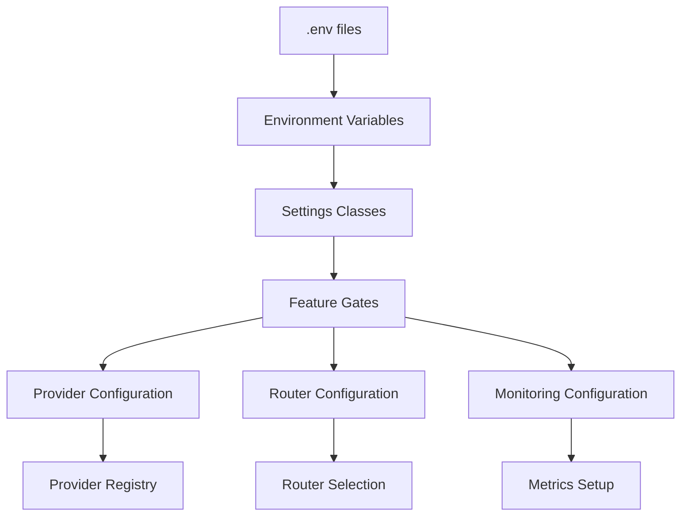

# ModelMuxer Architecture Overview

## System Overview

ModelMuxer is an enterprise-grade intelligent LLM routing engine designed for cost and performance optimization. The system intelligently routes requests to the most appropriate LLM provider based on content analysis, cost constraints, and performance requirements.

## Core Architecture Patterns

### 1. **Layered Architecture**
```
┌─────────────────┐
│   API Layer     │  ← FastAPI endpoints, middleware
├─────────────────┤
│  Service Layer  │  ← Business logic, routing, providers
├─────────────────┤
│   Core Layer    │  ← Interfaces, abstractions, utilities
├─────────────────┤
│ Persistence     │  ← Database, caching, configuration
└─────────────────┘
```

### 2. **Strategy Pattern (Routing)**
The system uses multiple routing strategies that can be selected based on deployment mode:
- **Heuristic Router**: Rule-based routing using pattern matching and keyword analysis
- **Semantic Router**: ML-based classification using embeddings (enhanced mode)
- **Cascade Router**: Cost-optimized cascading with fallback logic
- **Hybrid Router**: Combines multiple strategies with weighted decisions

### 3. **Adapter Pattern (Providers)**
Unified interface for multiple LLM providers through adapter classes:
- **Legacy Interface**: `LLMProvider` (backward compatibility)
- **Modern Interface**: `LLMProviderAdapter` (unified interface)
- **Provider Registry**: Centralized provider management and configuration

### 4. **Configuration-Driven Architecture**
Three deployment modes with feature gating:
- **Basic Mode**: Simple routing with essential features
- **Enhanced Mode**: Advanced routing with ML capabilities
- **Production Mode**: Full enterprise features with monitoring

## Component Relationships

### Core Components

#### 1. **API Layer (`app/main.py`)**
- **FastAPI Application**: RESTful API server with async support
- **Request Processing**: Handles chat completions, streaming, health checks
- **Middleware Integration**: Authentication, logging, rate limiting, CORS
- **Provider Management**: Dynamic provider loading and configuration

#### 2. **Routing System (`app/routing/`)**
```
BaseRouter (Abstract)
    ├── HeuristicRouter
    ├── SemanticRouter
    ├── CascadeRouter
    └── HybridRouter
```

**Key Features:**
- **Content Analysis**: Pattern matching, complexity analysis, keyword detection
- **Performance Optimization**: <100ms routing decisions, caching support
- **Fallback Logic**: Circuit breaker patterns, graceful degradation
- **Monitoring Integration**: Metrics collection, decision logging

#### 3. **Provider System (`app/providers/`)**
```
LLMProviderAdapter (Modern Interface)
    ├── OpenAIProvider
    ├── AnthropicProvider
    ├── GoogleProvider
    ├── GroqProvider
    ├── TogetherProvider
    ├── CohereProvider
    └── MistralProvider
```

**Key Features:**
- **Unified Interface**: Consistent API across all providers
- **Error Handling**: Retry logic, timeout management, circuit breakers
- **Cost Calculation**: Real-time cost estimation and tracking
- **Rate Limiting**: Provider-specific rate limit handling

#### 4. **Configuration System (`app/config/`, `app/settings.py`)**
```
Settings (Pydantic)
    ├── API Settings
    ├── Database Settings
    ├── Redis Settings
    ├── Security Settings
    ├── Routing Settings
    ├── Provider Settings
    └── Monitoring Settings
```

**Key Features:**
- **Environment-Based**: Different configs for dev/staging/production
- **Validation**: Type-safe configuration with Pydantic
- **Feature Gating**: Mode-based feature enablement
- **Hot Reloading**: Configuration updates without restart

#### 5. **Monitoring & Observability (`app/monitoring/`, `app/telemetry/`)**
```
MetricsCollector
    ├── Prometheus Metrics
    ├── OpenTelemetry Tracing
    ├── Structured Logging
    └── Health Checks
```

**Key Features:**
- **Request Metrics**: Response time, success rate, error rates
- **Cost Metrics**: Total cost, cost per request, budget utilization
- **Routing Metrics**: Selection accuracy, fallback frequency
- **Provider Metrics**: Availability, rate limits, response quality

## Data Flow Architecture

### Request Processing Flow



### Configuration Flow



## Key Interfaces and Abstractions

### 1. **RouterInterface**
```python
class RouterInterface(ABC):
    async def select_provider_and_model(
        self, messages: list[ChatMessage],
        user_id: str | None = None,
        constraints: dict[str, Any] | None = None
    ) -> tuple[str, str, str, float]:
        """Select optimal provider and model"""
```

### 2. **ProviderInterface**
```python
class ProviderInterface(ABC):
    async def chat_completion(
        self, messages: list[ChatMessage], model: str, **kwargs: Any
    ) -> ChatCompletionResponse:
        """Generate chat completion"""

    async def calculate_cost(
        self, input_tokens: int, output_tokens: int, model: str
    ) -> float:
        """Calculate request cost"""
```

### 3. **CacheInterface**
```python
class CacheInterface(ABC):
    async def get(self, key: str) -> Any | None
    async def set(self, key: str, value: Any, ttl: int | None = None) -> bool
    async def delete(self, key: str) -> bool
```

## Dependency Organization

### Core Dependencies
- **FastAPI**: Web framework for API endpoints
- **Pydantic**: Data validation and settings management
- **SQLAlchemy**: Database ORM and connection management
- **Redis**: Caching and session management
- **Structlog**: Structured logging

### Provider Dependencies
- **httpx**: Async HTTP client for provider APIs
- **tiktoken**: Token counting for OpenAI models
- **tenacity**: Retry logic for resilient API calls

### Optional Dependencies
- **ML Group**: `sentence-transformers`, `torch`, `transformers` (enhanced mode)
- **Monitoring Group**: `prometheus-client`, `opentelemetry-*` (production mode)
- **Development Group**: Testing, linting, and quality tools

### Security Dependencies
- **cryptography**: Secure credential handling
- **passlib**: Password hashing
- **pyjwt**: JWT token management

## Configuration Modes

### Basic Mode
- Simple heuristic routing
- Essential providers only
- Basic logging and monitoring
- SQLite database

### Enhanced Mode
- Advanced routing strategies (semantic, hybrid)
- ML-based classification
- Redis caching
- Enhanced monitoring
- PostgreSQL support

### Production Mode
- Full enterprise features
- Prometheus metrics
- OpenTelemetry tracing
- Advanced security features
- Comprehensive monitoring

## Security Architecture

### Authentication & Authorization
- API key authentication
- JWT token management
- Role-based access control
- Request validation and sanitization

### Data Protection
- PII detection and protection
- Secure credential management
- Encrypted database connections
- Input validation and sanitization

### Infrastructure Security
- Rate limiting
- DDoS protection
- Security headers
- Container security

## Monitoring & Observability

### Metrics Collection
- **Request Metrics**: Response times, success rates, error rates
- **Cost Metrics**: Total costs, per-request costs, budget utilization
- **Routing Metrics**: Selection accuracy, fallback frequency
- **Provider Metrics**: Availability, rate limits, performance

### Logging Strategy
- **Structured Logging**: JSON format with consistent fields
- **Log Levels**: DEBUG (routing), INFO (requests), WARN (fallbacks), ERROR (failures)
- **Correlation IDs**: Request tracing across components
- **Security**: No sensitive data in production logs

### Health Checks
- **Basic Health**: Core functionality verification
- **Detailed Health**: Provider connectivity checks
- **Metrics Endpoint**: Prometheus-compatible metrics

## Deployment Architecture

### Containerization
- Multi-stage Docker builds
- Minimal base images
- Resource limits and health checks
- Security hardening

### Infrastructure
- Kubernetes deployment manifests
- Horizontal Pod Autoscaling
- Service mesh integration
- Database and cache clustering

### CI/CD Pipeline
- Automated testing and quality gates
- Security scanning
- Dependency vulnerability checks
- Performance regression testing

## Performance Characteristics

### Routing Performance
- **Decision Time**: <100ms for production routing decisions
- **Caching**: Redis-backed routing decision cache
- **Concurrency**: Async/await patterns throughout
- **Resource Usage**: Minimal memory footprint

### Scalability
- **Horizontal Scaling**: Stateless design enables easy scaling
- **Provider Scaling**: Dynamic provider registration
- **Caching**: Multi-layer caching strategy
- **Database**: Connection pooling and query optimization

## Testing Strategy

### Test Organization
- **Unit Tests**: Provider and router logic testing
- **Integration Tests**: End-to-end request flows
- **Performance Tests**: Load testing and benchmarking
- **Security Tests**: Vulnerability scanning and penetration testing

### Test Coverage
- **Target**: 80%+ code coverage
- **Mocking**: Comprehensive mocking for external dependencies
- **Fixtures**: Realistic test data and scenarios
- **CI/CD**: Automated testing pipeline

## Development Workflow

### Code Quality
- **Linting**: Ruff for code style and error detection
- **Formatting**: Black for consistent code formatting
- **Type Checking**: MyPy for static type analysis
- **Security**: Bandit for security vulnerability detection

### Version Control
- **Branching**: Feature branches with conventional commits
- **Reviews**: Code review requirements for all changes
- **CI/CD**: Automated quality gates and testing
- **Documentation**: Updated with all changes

This architecture provides a robust, scalable, and maintainable foundation for intelligent LLM routing with enterprise-grade features and comprehensive monitoring capabilities.